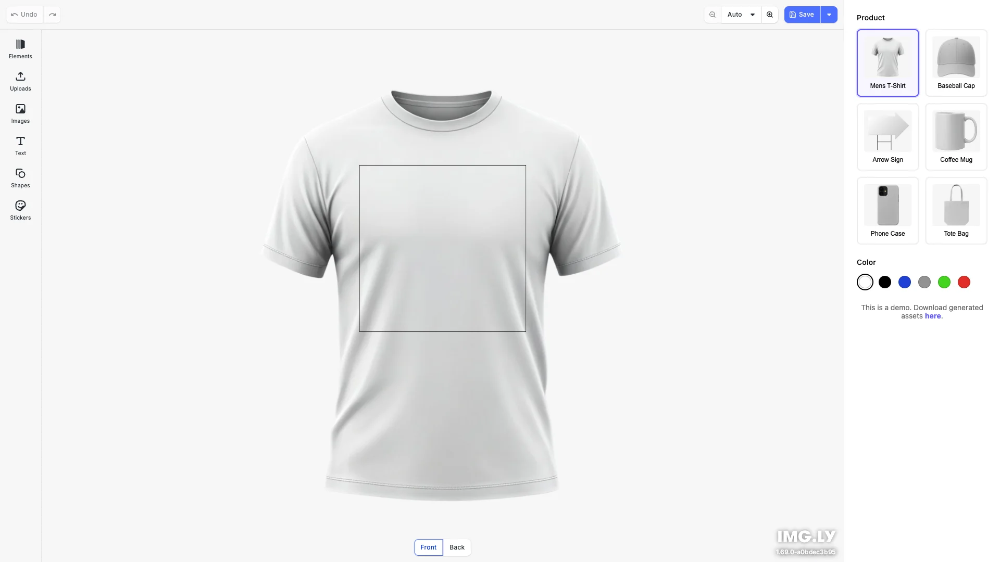

# Product Editor Starter Kit

Design on multiple products like t-shirts, mugs, phone cases, and more with real-time mockup previews. Built with [CE.SDK](https://img.ly/creative-sdk) by [IMG.LY](https://img.ly), runs entirely in the browser with no server dependencies.

<p>
  <a href="https://img.ly/docs/cesdk/starterkits/product-editor/">Documentation</a> |
  <a href="https://img.ly/showcases/cesdk">Live Demo</a>
</p>



## Getting Started

### Clone the Repository

```bash
git clone https://github.com/imgly/starterkit-product-editor-react-web.git
cd starterkit-product-editor-react-web
```

### Install Dependencies

```bash
npm install
```

### Download Assets

CE.SDK requires engine assets (fonts, icons, UI elements) served from your `public/` directory.

```bash
curl -O https://cdn.img.ly/packages/imgly/cesdk-js/$UBQ_VERSION$/imgly-assets.zip
unzip imgly-assets.zip -d public/
rm imgly-assets.zip
```

### Run the Development Server

```bash
npm run dev
```

Open `http://localhost:5173` in your browser.

## Configuration

### Loading Products

The editor loads products from a demo catalog. In production, replace `product-catalog.ts` with your own product data:

```typescript
// src/product-catalog.ts
export const PRODUCT_SAMPLES: ProductConfig[] = [
  {
    id: 'tshirt',
    label: 'Mens T-Shirt',
    designUnit: 'Inch',
    unitPrice: 19.99,
    areas: [
      { id: 'front', label: 'Front', pageSize: { width: 12, height: 12 }, mockup: { ... } },
      { id: 'back', label: 'Back', pageSize: { width: 12, height: 12 }, mockup: { ... } }
    ],
    colors: [
      { id: 'white', colorHex: '#FFFFFF', isDefault: true },
      { id: 'black', colorHex: '#000000' }
    ]
  }
];
```

### Theming

```typescript
cesdk.ui.setTheme('dark'); // 'light' | 'dark' | 'system'
```

See [Theming](https://img.ly/docs/cesdk/web/ui-styling/theming/) for custom color schemes and styling.

### Localization

```typescript
cesdk.i18n.setTranslations({
  de: { 'common.save': 'Speichern' }
});
cesdk.i18n.setLocale('de');
```

See [Localization](https://img.ly/docs/cesdk/web/ui-styling/localization/) for supported languages and translation keys.

## Architecture

```
starterkit-product-editor-react-web/
├── src/
│   ├── index.tsx                    # React entry point
│   ├── product-catalog.ts           # Product configurations (demo data)
│   ├── app/
│   │   ├── App.tsx                  # Main app component with CE.SDK
│   │   ├── App.module.css           # App layout styles
│   │   ├── Sidebar/                 # Sidebar container
│   │   │   ├── Sidebar.tsx
│   │   │   └── Sidebar.module.css
│   │   ├── ProductGrid/             # Product selection grid
│   │   │   ├── ProductGrid.tsx
│   │   │   └── ProductGrid.module.css
│   │   ├── ColorPicker/             # Color swatches
│   │   │   ├── ColorPicker.tsx
│   │   │   └── ColorPicker.module.css
│   │   └── DownloadLink/            # Download link
│   │       ├── DownloadLink.tsx
│   │       └── DownloadLink.module.css
│   └── imgly/
│       ├── index.ts                 # Editor initialization
│       ├── product.ts               # Product operations (scene/mockup/view)
│       └── config/
│           ├── plugin.ts            # Main plugin orchestration
│           ├── actions.ts           # Navigation bar actions
│           ├── features.ts          # Feature toggles
│           ├── settings.ts          # Engine behavior
│           ├── i18n.ts              # Internationalization
│           └── ui/                  # UI layout configuration
├── public/
│   └── assets/products/             # Product mockup images
├── package.json
└── vite.config.ts
```

## Key Capabilities

- **Product Mockups** – Real-time product previews with customizable areas
- **Multi-Area Editing** – Design on front, back, or multiple printable regions
- **Color Variants** – Switch between product colors instantly
- **Text & Graphics** – Add text, images, shapes with full editing controls
- **Export** – Download design assets as PNG, PDF, or scene archives
- **Custom Sidebar** – Integrated product and color selection

## Prerequisites

- **Node.js v20+** with npm – [Download](https://nodejs.org/)
- **Supported browsers** – Chrome 114+, Edge 114+, Firefox 115+, Safari 15.6+

## Troubleshooting

| Issue | Solution |
|-------|----------|
| Editor doesn't load | Verify assets are accessible at `baseURL` |
| Product images don't appear | Check `public/assets/products/` directory exists |
| Watermark appears | Add your license key |

## Documentation

For complete integration guides and API reference, visit the [Product Editor Documentation](https://img.ly/docs/cesdk/starterkits/product-editor/).

## License

This project is licensed under the MIT License - see the [LICENSE](LICENSE) file for details.

---

<p align="center">Built with <a href="https://img.ly/creative-sdk?utm_source=github&utm_medium=project&utm_campaign=starterkit-product-editor">CE.SDK</a> by <a href="https://img.ly?utm_source=github&utm_medium=project&utm_campaign=starterkit-product-editor">IMG.LY</a></p>
